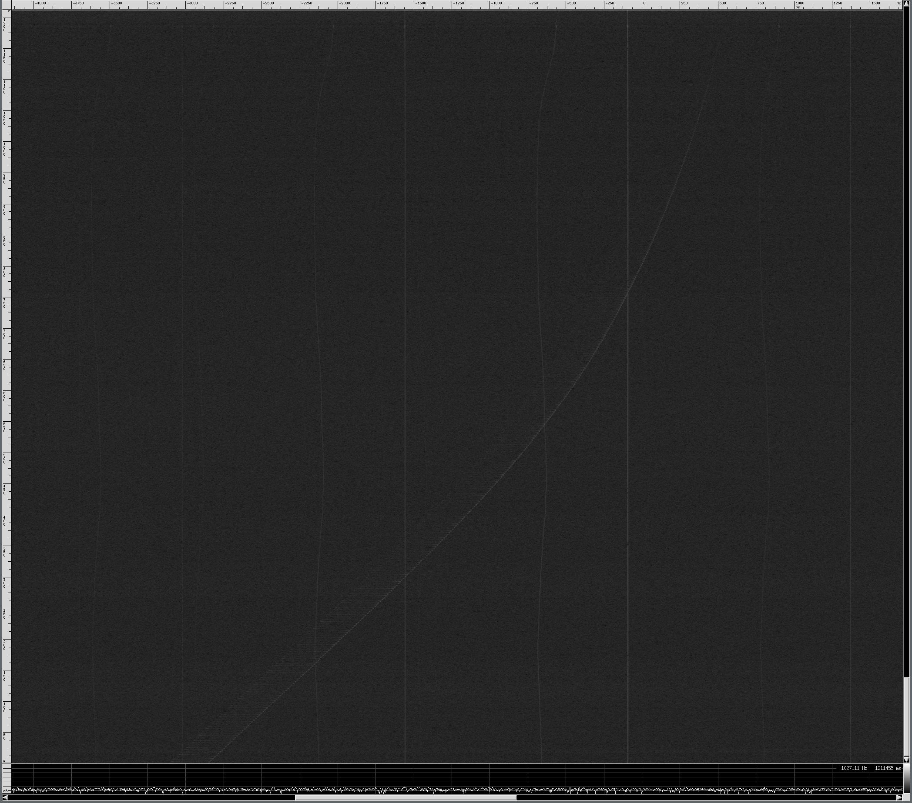
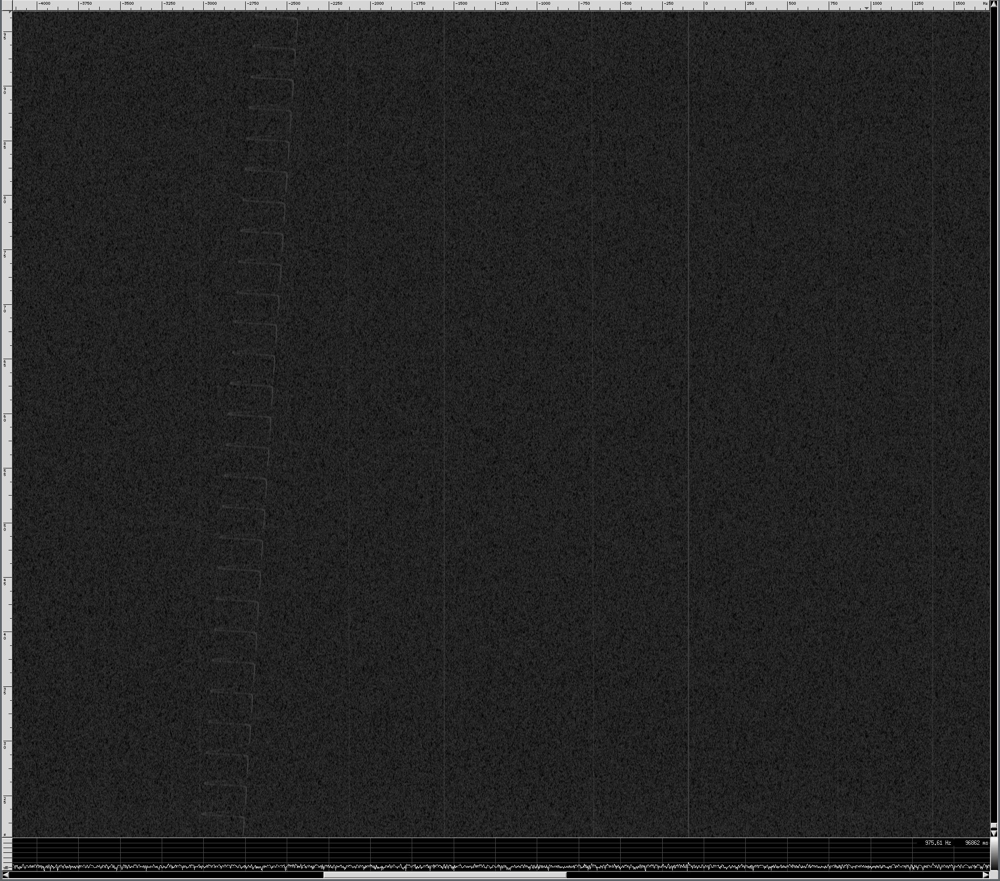
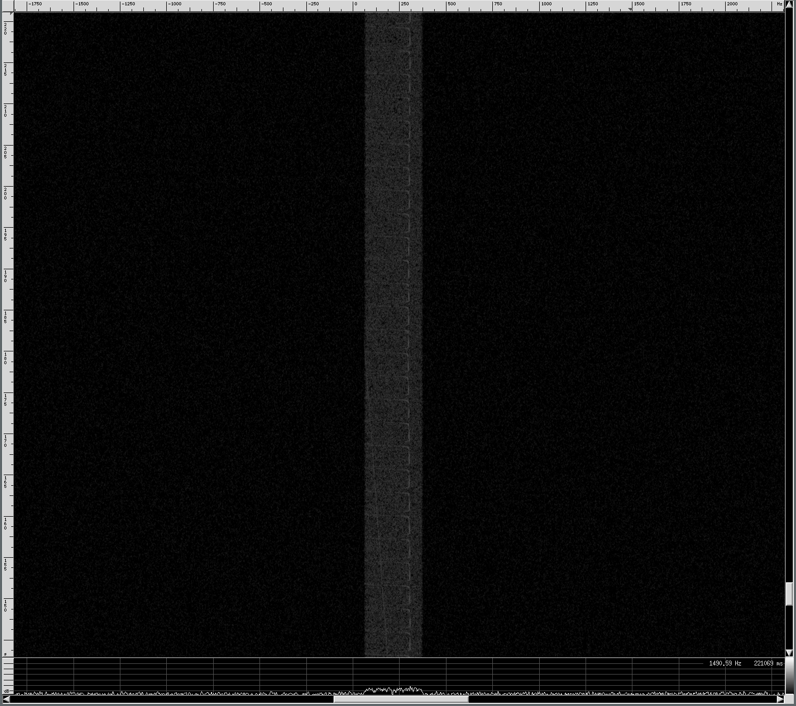

Twin Moons - LES-1 Tracking
===========================

Required tools
--------------

I use mostly open source and free tools to process the signal.

- [csdr](https://github.com/simonyiszk/csdr) : Signal processing from command line
- [baudline](http://www.baudline.com) : Excellent spetrogram tool for visualization of data
    The file **baudline_session_twin_moons** included in this repository can be used by baudline (-tsession flag) to setup baudline with the correct parameters to easilty view these files. You probably have to copy the file to ~/.baudline/sessions/twin_moons to work with the scripts below.
- Some custom scripts included in this repository


Data format
-----------

The original file **gqrx_20160911_164252_237000000_6000000_fc.raw** is a raw complex data stream (real and imaginary data) floating point 32-bit format. This means real (Re) and Imaginary (Im) samples are interleaved like this:

```
Re[0],Im[0],Re[1],Im[1]
```

Each sample is 4 bytes or 32-bits. Fortunately this is a very standard format and can be readily read with many tools.

If you want to visualize the full bandwidth signal, do so with baudline and csdr:

```bash
cat gqrx_20160911_164252_237000000_6000000_fc.raw | csdr flowcontrol 60000000 10 | baudline -tsession twin_moons  -stdin -format le32f -channels 2 -quadrature -flipcomplex -fftsize 16384 -samplerate 6000000  -scale 10000 -utc 2016:09:11-16:42:52
```

You won't see much since the resolution bandwidth (RBW) is still much too large to see any weak signal buried in the noise. To see the very weak signals, you need to decrease the RBW to the order of a few Hz per frequency bin. 


Decimate first
--------------

The original data was sampled at 6 Mega Samples per second (MSPS), this is good to capture all possible signals, but tough to work with. Since sleuthing around the original file showed me the LES-1 signal is very close to 0 Hz, this means we can filter and decimate to get the file size to something more reasonable.

Let's decimate by 256, this will reduce the file size by a factor of 256 while still preserving the signal that occupies only a few kHz around 0 Hz. We can do this easily with csdr:

```bash
cat gqrx_20160911_164252_237000000_6000000_fc.raw | csdr fir_decimate_cc 16 0.05 | csdr fir_decimate_cc 16 0.05 | csdr fir_decimate_cc 8 0.05 > data_down256.bin
```

We do the decimation in three steps, experimentation with csdr showed we throw away 1 or 2 dB of SNR when decimating by 32 or greater.

So now you will have a new file called **data_down256.bin** which still contains 32-bit floating point complex samples - the sample rate is 6MSPS/256 = 23437.5 samples per second (23.4375 kHz)

Let's see how this file looks!


```bash
cat data_down256.bin | csdr flowcontrol 60000000 10 | baudline -tsession twin_moons  -stdin -format le32f -channels 2 -quadrature -flipcomplex -fftsize 16384 -samplerate 23437.5  -scale 10000 -utc 2016:09:11-00:00:00
```

You should see output similar to this.

This plot shows frequency vs. time, color indicates signal strength. The LES-1 signal is clearly visible by looking at the doppler shift - orbiting objects move differently than stuff 'stationary' on Earth.



The zoomed in plot shows clearly the frequency shift of the spacecraft carrier frequency.




Removing the doppler shift
--------------------------

We have a challenge now, we want to remove the overall frequency shift, but not get rid of the frequency shift due to the transmitter turning on/off an changing frequency. A FLL/PLL might do the trick when you fiddle with the correct loop bandwidth, but there wasn't time for this. I came up with a crude hack where a human estimates by eye the doppler shift every couple of minutes, puts this in a text file, then the computer interpolates and removes this doppler. 

The script doing this is called **csdr_doppler.py** included in this repository. The idea is you can plug this into the signal processing pipeline. Let's give it a spin and see if it works:

```bash
cat data_down256.bin | ./csdr_doppler.py --fs 23437.5  --dopestimate ./dop.txt | csdr flowcontrol 28750000 20 | csdr bandpass_fir_fft_cc -0.01 0.003 0.001 | ./csdr_doppler.py --fs 23437.5 --fc -300 | baudline -tsession twin_moons  -stdin -format le32f -channels 2 -quadrature -flipcomplex -fftsize 16384 -samplerate 23437.5  -scale 10000 -utc 2016:09:11-00:00:00
```

This actually does a couple of things:

- **csdr_doppler.py --dopestimate ./dop.txt** : Reads the dop.txt file, interpolates and removes the doppler.
- **csdr bandpass_fir_fft_cc** : Applies a bandpass filter so we get **just** the signal we want. If we do not filter out the other noise it sounds crappy on the human ear




Making a sound file
-------------------

Let's put this all together and make a sound file. We do this in a few steps:

- ./csdr_doppler.py --fs 23437.5  --dopestimate ./dop.txt : As usual, apply doppler correction
- csdr bandpass_fir_fft_cc: Remove noise
- ./csdr_doppler.py --fs 23437.5 --fc -500 : the --fc -500 will shift the frequency by -500 Hz (so move it up by 500 Hz), this is how you would change the pitch.
- csdr realpart_cf : Grabs only the real part of the signal, this is what's needed to convert to sound
- csdr agc_ff : Gain control to scale the voltage appropriately
- csdr limit_ff : Clipping
- csdr convert_f_s16 : Convert to 16-bit from floating point
- mplayer... : Use mplayer to convert to .wav file

```bash
cat data_down256.bin | ./csdr_doppler.py --fs 23437.5  --dopestimate ./dop.txt | csdr bandpass_fir_fft_cc -0.01 0.003 0.001 | ./csdr_doppler.py --fs 23437.5 --fc -500 | csdr realpart_cf | csdr agc_ff | csdr limit_ff | csdr convert_f_s16 | mplayer -cache 1024 -quiet -rawaudio samplesize=2:channels=1:rate=28000 -demuxer rawaudio - -ao pcm:fast:file=audio_long2.wav

```

Now convert to mp3

```bash
ffmpeg -i audio_long2.wav audio_long_300Hz.mp3
```
