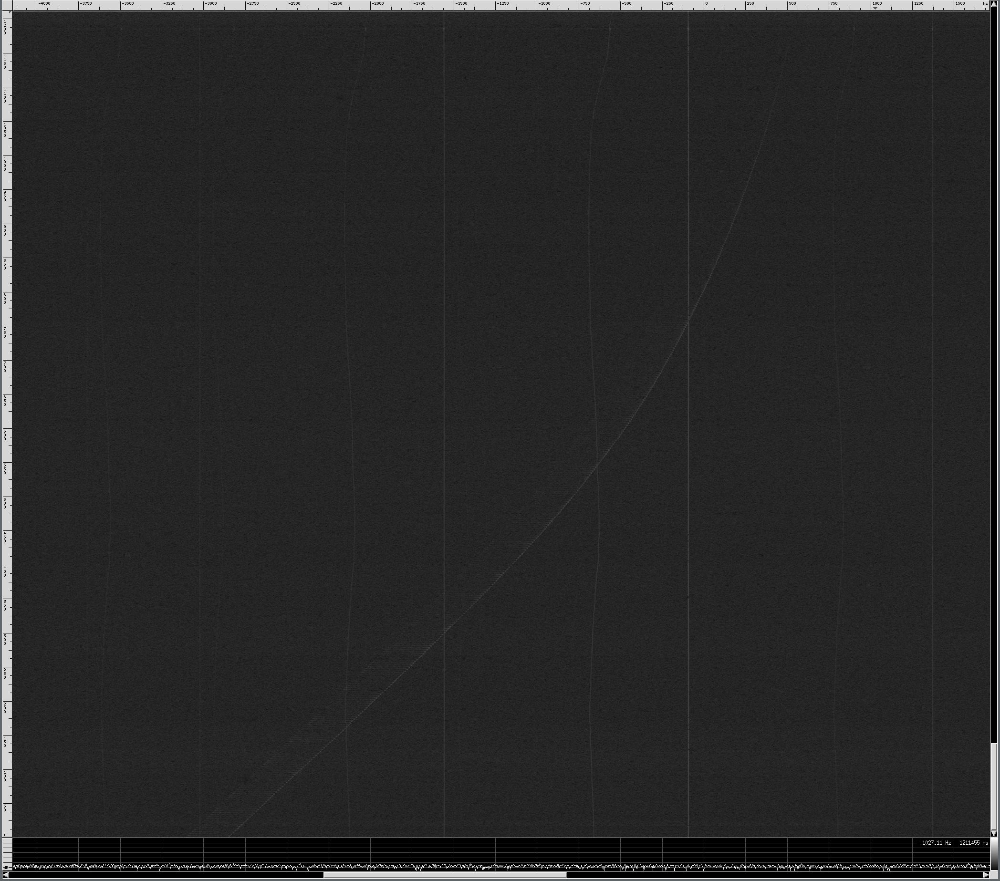
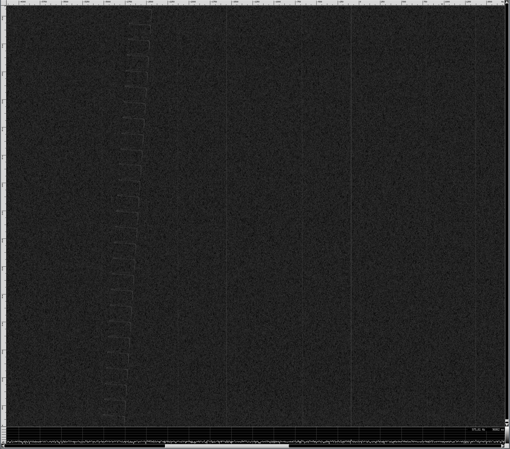

Twin Moons - LES-1 Tracking
===========================

Required tools
--------------

I use mostly open source and free tools to process the signal.

- [csdr](https://github.com/simonyiszk/csdr) : Signal processing from command line
- [baudline](http://www.baudline.com) : Excellent spetrogram tool for visualization of data
- Some custom scripts included in this repository


Data format
-----------

The original file **gqrx_20160911_164252_237000000_6000000_fc.raw** is a raw complex data stream (real and imaginary data) floating point 32-bit format. This means real (Re) and Imaginary (Im) samples are interleaved like this:

```
Re[0],Im[0],Re[1],Im[1]
```

Each sample is 4 bytes or 32-bits. Fortunately this is a very standard format and can be readily read with many tools.

If you want to visualize the full bandwidth signal, do so with baudline and csdr:

```bash
cat gqrx_20160911_164252_237000000_6000000_fc.raw | csdr flowcontrol 60000000 10 | baudline -tsession twin_moons  -stdin -format le32f -channels 2 -quadrature -flipcomplex -fftsize 16384 -samplerate 6000000  -scale 10000 -utc 2016:09:11-16:42:52
```

You won't see much since the resolution bandwidth (RBW) is still much too large to see any weak signal buried in the noise. To see the very weak signals, you need to decrease the RBW to the order of a few Hz per frequency bin. 


Decimate first
--------------

The original data was sampled at 6 Mega Samples per second (MSPS), this is good to capture all possible signals, but tough to work with. Since sleuthing around the original file showed me the LES-1 signal is very close to 0 Hz, this means we can filter and decimate to get the file size to something more reasonable.

Let's decimate by 256, this will reduce the file size by a factor of 256 while still preserving the signal that occupies only a few kHz around 0 Hz. We can do this easily with csdr:

```bash
cat gqrx_20160911_164252_237000000_6000000_fc.raw | csdr fir_decimate_cc 16 0.05 | csdr fir_decimate_cc 16 0.05 | csdr fir_decimate_cc 8 0.05 > data_down256.bin
```

We do the decimation in three steps, experimentation with csdr showed we throw away 1 or 2 dB of SNR when decimating by 32 or greater.

So now you will have a new file called **data_down256.bin** which still contains 32-bit floating point complex samples - the sample rate is 6MSPS/256 = 23437.5 samples per second (23.4375 kHz)

Let's see how this file looks!


```bash
cat data_down256.bin | csdr flowcontrol 60000000 10 | baudline -tsession twin_moons  -stdin -format le32f -channels 2 -quadrature -flipcomplex -fftsize 16384 -samplerate 23437.5  -scale 10000 -utc 2016:09:11-00:00:00
```

You should see output similar to this:






